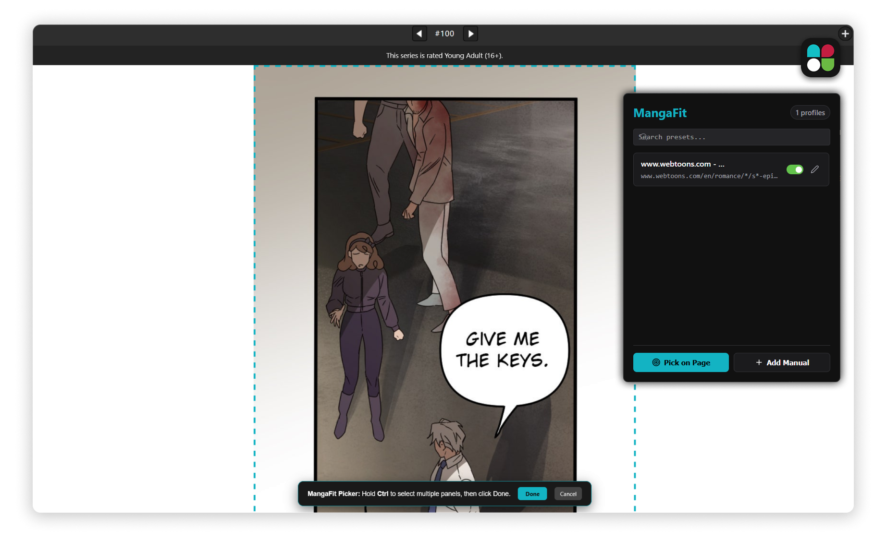

# MangaFit


MangaFit is a highly customisable browser extension built using [WXT](https://wxt.dev/) and React. It is designed to scale and fit images, comic panels, or webtoon layouts on any website. With an interactive element picker, live previewing, and wildcard URL pattern support, you can easily control how visual content renders in your browser.



## Getting Started (for Developers)

To get a local development copy up and running, follow these steps.

### Prerequisites

*   **Node.js:** (LTS version recommended)
*   **pnpm**

### Installation

1.  **Clone the repository:**
    ```bash
    git clone https://github.com/Lorg0n/manga-fit.git
    cd mangafit-fit
    ```
2.  **Install the dependencies:**
    ```bash
    pnpm install
    ```

### Development

MangaFit leverages the WXT framework to run a local development server with Hot Module Replacement (HMR) and automatic extension reloading.

*   **Start development mode for Chrome:**
    ```bash
    pnpm dev
    ```
*   **Start development mode for Firefox:**
    ```bash
    pnpm dev:firefox
    ```

These commands will compile the project in development mode, open a clean browser instance, and watch for real-time changes in your source files.

### Building for Production

To compile and pack the extension for production deployment:

*   **Build for Chrome (Manifest V3):**
    ```bash
    pnpm build
    ```
*   **Build for Firefox (Manifest V2):**
    ```bash
    pnpm build:firefox
    ```
*   **Generate zip files for store submission:**
    ```bash
    pnpm zip
    # or
    pnpm zip:firefox
    ```

Production build files are exported to the `.output/` folder.

---

## Loading the Extension in Your Browser

If you built the extension manually using `pnpm build` or are exploring the development workspace:

### Google Chrome / Chromium-based Browsers

1.  Open Chrome and navigate to `chrome://extensions`.
2.  Enable **Developer mode** using the toggle switch in the top-right corner.
3.  Click the **Load unpacked** button.
4.  Navigate to your project directory, open `.output`, select the `chrome-mv3` folder, and click **Select**.

### Mozilla Firefox

1.  Open Firefox and navigate to `about:debugging#/runtime/this-firefox`.
2.  Click the **Load Temporary Add-on...** button.
3.  Navigate to your project directory and locate the `.output/firefox-mv2` folder.
4.  Select the `manifest.json` file inside that folder.

---

## Contributing

Contributions are helpful for making MangaFit a more robust tool for the community. If you would like to contribute:

1.  Fork the Project.
2.  Create your Feature Branch (`git checkout -b feature/AmazingFeature`).
3.  Commit your changes (`git commit -m 'Add some AmazingFeature'`).
4.  Push to the Branch (`git push origin feature/AmazingFeature`).
5.  Open a Pull Request.

Please ensure your code conforms to the project's formatting and passes general TypeScript configuration checks before opening a pull request.

---

## License

This project is licensed under the MIT License.

---

## Acknowledgements

*   [WXT Next-gen Framework](https://wxt.dev/)
*   [React](https://react.dev/)
*   [Lucide Icons](https://lucide.dev/)
*   [@medv/finder selector generation utility](https://github.com/antonmedv/Finder)